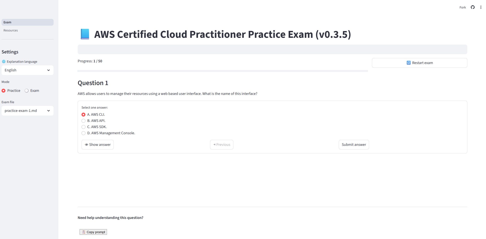

# AWS CLF-C02 Exam Preparation

📚 This project contains resources and tools to help prepare for the AWS Certified Cloud Practitioner (CLF-C02) exam.
📦 Version: 0.3.6

Deployed on cloud:
https://github.com/enhorse/java-interview?tab=readme-ov-file



## 🧰 Project Structure

- `exams/` — Practice exams in markdown format.
- `pages/` — Web app UI components.
- `Exam.py` — Python script to parse and render exams.
- `start.bat` — Starts the Streamlit app.
- `install_env.bat` — Installs required Python environment.
- `requirements.txt` — Python dependencies.
- `version` — Contains current version of the app.
- `README.md` — You're reading it :)

## ▶️ How to Run

1. Install the environment:

    ```bash
    .\install_env.bat
    ```

2. Start the application:

    ```bash
    .\start.bat
    ```

## 🧪 Requirements

All dependencies are in `requirements.txt`. They will be installed automatically using `install_env.bat`.

